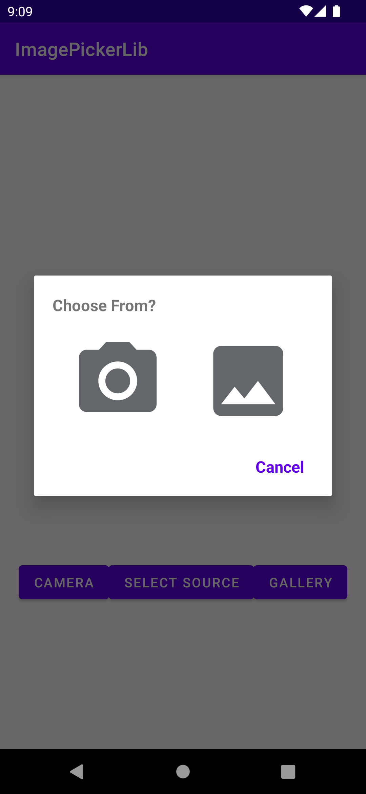

 # Ronnie-Image-Picker

Asks for Camera and storage permission and return uri of the images taken or picked from the gallery.

Min Api Level: 16

Build System : [Gradle](https://gradle.org/)

 [](https://jitpack.io/#ronnieotieno/Ronnie-Image-Picker)

## Getting started

You don't need to declare the permissions in the manifests.

Add this in your root build.gradle or settings.gradle if in version Arctic Fox and above at the end of repositories:

```groovy
allprojects {
    repositories {
        ...
       maven { url 'https://jitpack.io' }
    }
}
```
Add this to dependencies:

```groovy
dependencies {
	     implementation 'com.github.ronnieotieno:Ronnie-Image-Picker:1.1.0' //Add latest version
	}
```
Example in code, Kotlin:

```kotlin
  lateinit var imagePicker : ImagePicker //You need to instantiate it in Oncreate
  
   override fun onCreate(savedInstanceState: Bundle?) {
        super.onCreate(savedInstanceState)

	 //activity or fragment
	 imagePicker = ImagePicker(this)
      
      //Camera
      openCameraBtn.setOnClickListener {
          imagePicker.takeFromCamera { imageResult ->
              imageCallBack(
                  imageResult
              )
          }
      }
      
      //Gallery
      openGalleryBtn.setOnClickListener {
          imagePicker.pickFromStorage { imageResult ->
              imageCallBack(
                  imageResult
              )
          }
      }
      
      //Open Dialog with source selection
      openSelectionButton.setOnClickListener {
          imagePicker.selectSource { imageResult ->
              imageCallBack(
                  imageResult
              )
          }
      }
  }

  //CallBack for result
  private fun imageCallBack(imageResult: ImageResult<Uri>) {
    when (imageResult) {
        is ImageResult.Success -> {
            val uri = imageResult.value
            imageView.setImageUri(uri)
        }
        is ImageResult.Failure -> {
            val errorString = imageResult.errorString
            Toast.makeText(this@MainActivity, errorString, Toast.LENGTH_LONG).show()
        }
    }
}
```
Example in code,Java:

```java
  public class MainActivity2 extends AppCompatActivity {

    ImageView imageView;
    ImagePicker imagePicker; //You need to instantiate it in Oncreate 
    
    @Override
    protected void onCreate(Bundle savedInstanceState) {
        super.onCreate(savedInstanceState);
        setContentView(R.layout.activity_main);

        //activity or fragment
        imagePicker = new ImagePicker(this);

        Button camera = findViewById(R.id.openCamera);
        imageView = findViewById(R.id.imageView);
        Button storage = findViewById(R.id.openStorage);
        Button openSelection = findViewById(R.id.openSelection);


        //Camera
        camera.setOnClickListener(v -> imagePicker.takeFromCamera(imageCallBack()));

        //Gallery
        storage.setOnClickListener(v -> imagePicker.pickFromStorage(imageCallBack()));

        //Open Dialog with source selection
        openSelection.setOnClickListener(v -> imagePicker.selectSource(imageCallBack()));


    }

    //CallBack for result
    private Function1<ImageResult<? extends Uri>, Unit> imageCallBack() {
        return imageResult -> {
            if (imageResult instanceof ImageResult.Success) {
                Uri uri = ((ImageResult.Success<Uri>) imageResult).getValue();
                imageView.setImageURI(uri);
            } else {
                String errorString = ((ImageResult.Failure) imageResult).getErrorString();
                Toast.makeText(MainActivity2.this, errorString, Toast.LENGTH_LONG).show();
            }
            return null;
        };
    }
}

```
## Demo

Version 1.0.0 introduced dialog selection


